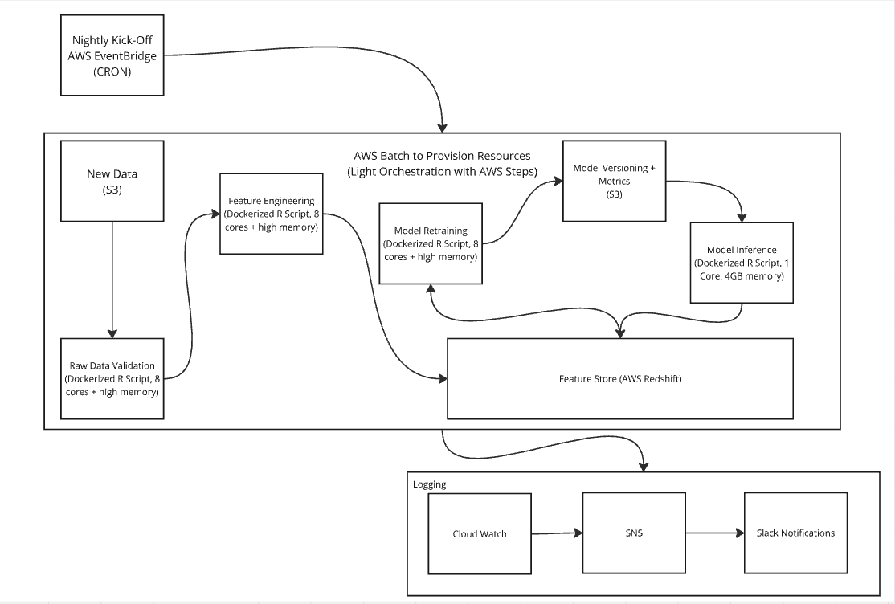

# Michael Mullarkey's Responses to Zelus Analytics Take Home

## Question #1



### My proposed architecture

Since the predictions need to be delivered overnight, not in real time, we're 
going to architect a batch ML deployment. I'm going to focus on the ML 
infrastructure and leave out other important processes such as security (how are IAM roles configured?) 
and analytics engineering (do we use dbt or SQLMesh to make the feature store data more accessible to end users?). 

The batch ML deployment will use the following steps:

#### Step 1 
Kick off the entire process in the early morning local time after all games should be complete using 
EventBridge scheduler (CRON expression) with an AWS Batch target. (DOUBLE CHECK IF ALL HAPPEN IN SAME PLACE OR DIFFERENT TIME ZONES)
The remaining steps are jobs inside of AWS Batch, which we will track with AWS Step Functions for lightweight orchestration.

#### Step 1 Reasoning: 
While we could use an orchestrator like Airflow or Dagster those tools 
add unnecessary overhead for getting from 0 - 1. If we identify that this process 
could benefit from orchestration that can be added later. Since this style of 
cricket is limited to "one day" play via limiting the number of overs, we know 
roughly how much data we're getting each day + when we'll get it. 
If we were dealing with international test matches that can last up to five days 
(but also could end at any point within those five days), an orchestrator might be more appropriate. 
AWS Batch + AWS Steps also allows us to implement the necessary sequencing, 
retries, etc. for each of the following steps. One tradeoff is there is a bit of 
vendor lock-in from using AWS Steps vs. an open-source orchestrator. However, 
since our jobs primarily consist of Docker containers they will be portable to 
other services, and changing cloud providers is already a large lift.

#### Step 2
A Dockerized R script on AWS Batch provisioned with 8 cores + large memory. 
Reads the data from its source (let’s assume S3, and performs initial raw data 
validation using the pointblank package in R. We'll start with simple checks 
such as no duplicate keys, no null keys, no excessive null values, no massive outliers, etc. 
All validation results will be logged to Cloud Watch, and any failures will 
initiate a retry before ultimately failing if all tests are not passed after three 
retries. If this failure happens Cloud Watch can trigger an SNS alert which in 
turn sends a Slack notification so the team can debug. We will also have included 
unit tests from testthat during the development process to help ensure the quality of the architecture.

#### Step 2 Reasoning: 
pointblank allows us to get clear pass/fail decisions on raw data quality that are easily logged. 
Initiating a small number of retries allows us to have some fault tolerance while not infinitely 
looping in case of consistent data validation failure. We also use AWS Batch along with the future and furrr packages in R 
to make sure this process can happen in parallel for different games at the same time to reduce runtime. 
However, if we the 8 core, large memory compute can't be used for the feature validation + engineering section of model training 
we will have to use alternate resources that could bottleneck the process (e.g., Dockerized plumber API deployed on Fargate, 
ideally multiple cores so we can scale up and down API instances with Valve) 
Using AWS Batch also helps us reduce costs by giving us the ability to provision larger compute and memory resources on the spot 
rather than leaving, for example, large EC2 instances running.

#### Step 3
Send the validated raw data to another Dockerized R script and run on AWS Batch with 8 cores + large memory provisioned. 
Here we create the necessary play by play features using data transformation tools in R, then use inequality + rolling joins in R 
to approximate "as of" style joins. These joins send the features to a feature store database (Postgres, so on AWS we use Redshift) + 
use metadata to version the database so we have clear "point in time" data for making predictions. 
In other words, make sure the features from games day-before-yesterday are updated to have the labels generated by yesterday's 
model predictions. At the same time, we make sure today's games have predictive features but no labels yet. 
We'll include pointblank data validation tests to ensure these joins are performing as expected.

#### Step 3 Reasoning
A good batch ML deployment needs a feature store, and with R to my knowledge we have to "roll our own" rather than using ones 
provided by AWS Sagemaker or Hopworks (which have support for this feature store pattern through Python + other non-R languages). 
We want to make sure we have up to date labels for yesterday's data for retraining the model, while also ensuring we don't 
accidentally provide labels to feature sets that haven't received predictions yet. 
We're defaulting to using a Postgres database (Redshift) as our feature store. However, if we wanted to simplify this process 
while likely increasing costs + vendor lock-in we could use Sagemaker Feature Store.

#### Step 4
Use a Dockerized R script with 8 cores and large memory usage provisioned via AWS Batch to retrain our labeling model using 
our updated feature store data. Crucially, we do not include today's feature set data, which is held out for later prediction. 
We'll use the tidymodels framework + 10-fold cross-validation and grid search to find the optimal hyperparameters. 
We'll likely ensemble different model predictions using workflowsets + stacks packages as long as time and compute permits. 
We will log model performance metrics along with the optimal hyperparameters to Cloud Watch. 
Then, we'll save this model version via vetiver to an S3 board, which automatically versions + updates the model metadata. 
We'll also compare the model's performance on cross-validation vs. previous iterations of the model. 
If the model performs outside of a predefined fault tolerance range we will still save the model version, 
but will roll back to the last model version that passed fault tolerance. This result should also trigger an SNS alert + Slack message.

#### Step 4 Reasoning
The tidymodels framework provides the most robust, actively developed infrastructure for ML in R. Vetiver allows us to get 
similar model versioning we would from, for example, MLFlow Model Registry used with Python. 
We also log the performance of models + their ensemble to identify any potential issues or changes over time in model training. 
It’s also important to have roll back procedures if for whatever reason the model’s performance is outside of an acceptable range. 
We also need automated notifications of this roll back so we aren’t relying on people to manually inspect logs for issues.

#### Step 5
Pull the most recent model that’s inside fault tolerance from S3 using a Dockerized R script provisioned with 1 core and 
4 GB of memory from AWS Batch. Create labels for the feature sets game by game, and send those predictions back to the feature 
store database with the necessary data to identify "point in time" prediction (likely via inequality or rolling joins). 
In other words, we recognize that these labels now exist from the model trained today, but these labels weren't available 
prior to the model retraining.These inequality or rolling joins will be validated with the pointblank package.

#### Step 5 Reasoning
This process uses the resource constraints as provided and updates the feature store database. 
We're using the most recent fault tolerant version of our model via vetiver, and we keep the feature store straight by using metadata 
to make clear which "point in time" we're talking about, We also want to make sure we provision enough resources here, 
since while technically an AWS Lambda can have 1 core and 4GB of memory its timeout is 15 minutes max. 
Since we have up to an hour of compute time we’ll want to make sure that’s part of how we provision as well.

## Question 2

From 1 to 5 I'm a 1 on cricket knowledge. My only knowledge comes from the 
[Wikipedia page](https://en.wikipedia.org/wiki/One_Day_International) in the problem statement, 
[this Youtube explainer](https://www.youtube.com/watch?v=EWpbtLIxYBk) I remembered going around a while back, 
and posts on Bluesky when the USA upset Pakistan last year.

## Question 3a

You can find my approach to cleaning and curating this data in `R/train.R` script.

Narrowing to men's matches was relatively straightforward. However, in order to filter out matches with no result you have
to look across `outcome.result` and `result` columns. I see in [the documentation](https://cricsheet.org/format/json/#outcome) that only the `outcome.result` column is expected,
so I appreciate the extra challenge here.

Working at the match level first then lets us filter down the deliveries data to make that join faster. 
We also had to filter out the variety of duplicate delivery data or else we'd end up with "remaining_wickets" values as low as -4.  

I saved the intermediate data with the requested columns (along with a few features for the model) both in JSON format as requested
and also parquet format to speed up the process. These files are in `data/processed/` directory while the raw files are in `data/raw/`. 

## Question 3b

You can find my model training code in the `R/train.R` script.

I used the `{tidymodels}` framework from R to be build reproducible pipelines, avoid data leakage, etc. I focused on getting a predictor 
for deployment, not a cutting-edge model for predicting as instructed. 

To that end, the only features I included were a historical average of runs scored in a given over 
(calculated separately within train and test sets to avoid data leakage), which team is bowling, which team is batting, 
which inning it is, which over it is, and dates features (since [this Wikipedia article](https://en.wikipedia.org/wiki/Run_rate) 
mentioned changes in average run rate over time). 

I also chose an elastic net model since I like starting with linear models and its
lasso + ridge penalties are helpful when certain features might be completely irrelevant. I did consider XGBoost and LightGBM given
how well boosted trees perform on tabular data, but had issues installing them using `{renv}`. In this case the trade-off between
having a reproducible deployment environment and potentially having a higher performing model was straightforward. Therefore,
I stuck with elastic net.

If I were more focused on modeling, some low-hanging fruit I'd pursue would be:
- Trying different transformations of the runs_in_over outcome data, since it has an interesting, non-normal distribution
- Accounting for park effects (mentioned in the Youtube explainer from Question 2)
- Determining the home team (making sure to account for when there's a neutral site)
- Doing more extensive hyperparameter tuning
- Solving the `{renv}` install issue and running experiments using different models + their ensembles

Some more in-depth approaches could be:
- Accounting for individual batsman and individual bowler quality
- Bringing in Elo-style team quality metrics

I also used the `{butcher}` package to reduce the size of the model artifact to speed up inference, and saved the model in .rds format
for more local-style use (vs. saving as vetiver if we were doing an API-style deployment).

## Question 4

### Bottom line

You can run the shell script for the earliest 5 overs Ireland batted during the provided data by: 

Pulling the Docker container from Docker Hub

```
docker pull mcmullarkey/cricket-predictions
```

Running the Docker container in interactive mode

```
docker run -it mcmullarkey/cricket-predictions
```

And running the following command inside the Docker container

```
./scripts/predict.sh -team Ireland -overs 5
```

You can get predictions for any number of the earliest overs a given team batted using the format:

```
./scripts/predict.sh -team <TEAM NAME> -overs <NUMBER OF OVERS>
```

### Reasoning

I took the question prompt as asking me to build a Docker container where the model could both be trained and provide inferences
on the command line. It's possible making it so we can train the model is overkill, but I wanted to cover my bases!

Given that, I used a two-stage Docker container where I started from the rocker/tidyverse base image, installed some necessary 
Linux packages, and then install exact R package versions using an renv lockfile. I then copy over necessary R scripts and run
the model training via `R/train.R`.

To finish the first stage of the build, I create a more minimal version of the renv lockfile that only includes R packages used
in inference + testing. That way during the second stage the install will be faster and we end up with a smaller container size overall.

This reduction is necessary, because in the second stage of the build I copy over the trained model and the data necessary to get inferences.
I could of course reduce the container size by not including the data, but I decided to trade that off with having an all in one,
packaged solution in the Docker container. The trade-offs were interesting, and in my mind the costliest error in this context
was people not having what they needed to test my solution. In another set of circumstances I could imagine making the opposite
choice.

I also copy over a `R/predict.R` script plus the requested shell script `scripts/predict.sh` from the first stage of the build.

After `scripts/predict.sh` kicks off the process, `R/predict.R` validates the arugments, runs the model inference, and 
feeds back the predicted runs for a given over along with contextual data like dates, batting team, bowling team, and the over.

## Question 5

Before tackling the testing, there are several filters users can take advantage of with this tool.

Users must specify a team and number of overs, which will default to showing the earliest overs where that team was batting in the 
data.

However, you can also specify whether you want the latest available overs in the data + whether the specified team should be bowling
or batting.

For example:

```
./scripts/predict.sh -team Bangladesh -overs 5 -order latest -role bowling
```

Given this expanded functionality, let's start by talking about the unit tests + error handling during predictions/inference.

The unit tests for `R/predict.R` live in `tests/testthat/test-predict.R`. We create minimal mock data and make sure we can handle
more expected use cases (The latest 5 Irish overs when they were bowling) and more edge cases (more overs are requested than available in the data). 

I also give informative error messages from the shell script such as this one
for if someone tried

```
./scripts/predict.sh -team Bangladesh -overs 5 -order recent -role bowling
```

```
echo "Error: order must be either 'earliest' or 'latest'"
```

I also added unit tests for the training code for some of the most crucial data transformation functions. These live at
`tests/testthat/test-train.R`. 

In addition to these unit tests, I took any initially ad-hoc data validation and put that more formally into tryCatch blocks. 
For example, while previously I had ad hoc code that looked like this to verify no duplicate delivery 
data

```
 df |>
    group_by(matchid, innings, over, delivery) |>
    summarize(n = n(), .groups = "drop") |>
    filter(n > 1)
```
I added this to a tryCatch block instead

```
duplicates <- transformed_df |>
        group_by(matchid, innings, over, delivery) |>
        summarize(n = n(), .groups = "drop") |>
        filter(n > 1)

      if (nrow(duplicates) > 0) {
        duplicate_details <- duplicates |>
          arrange(desc(n)) |>
          head(5)

        error_msg <- sprintf(
          "Duplicate entries found in transformed data for %d match-innings-over-delivery combinations. First %d examples:\n%s",
          nrow(duplicates),
          min(5, nrow(duplicates)),
          paste(capture.output(print(duplicate_details)), collapse = "\n")
        )
        stop(error_msg)
      }
```

I did this to double-check no non-men matches were in the data, that the number of remaining overs + wickets were sensible, and there
was no duplicate delivery by delivery data.

I also added logging via the `{logger}` package for informational, debugging, and error catching purposes. I therefore also added a 
tryCatch block to the modeling process so if anything went wrong there it would be visible in the logs. A cool real-life extension
of the `{logger}` package is it can also be configured to send Slack messages as well. Less manual log reading!

However, if you would like to look manually at the logs from the training run, you can do so by running

```
cat logs/model_training.log
```
inside the Docker container.

If you inspect those logs you'll see that there are several model artifacts available.
The fitted workflow that powers inference lives at `models/runs-avg-elnet-rds.rds`. The best cross-validation metrics
live at `models/metrics/model_cv_performance.csv`. You can view them by running

```
cat models/metrics/model_cv_performance.csv
```
inside the Docker container.

If you'd prefer to get all kinds of other metrics from the training run + cross-validation the entire tuning grid object lives
at `models/metrics/full_tuning_grid.rds`. This could allow even deeper diagnostics into model training. That way if I (or someone else)
gets a bright idea that would require looking more closely at the training run, we still have access to that information.

I had a blast tackling this challenge, and I'd be happy to answer any questions or chat about any element of this process!
